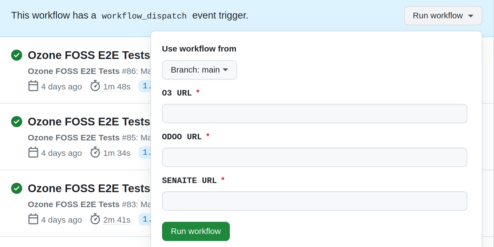
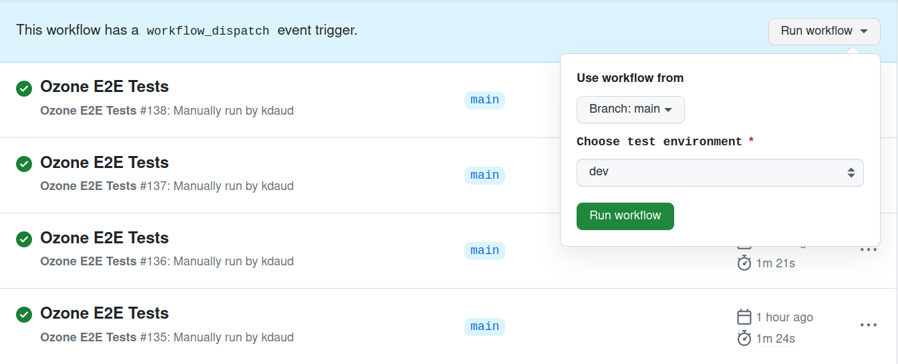

# Ozone E2E Test Suite

[](https://github.com/ozone-his/ozone-e2e/actions/workflows/pro.yml)

Welcome to Ozone automated test suite.

- [Setup Steps](#setup-steps)
  * [Step 1. Setup the project](#step-1-setup-the-project)
  * [Step 2. Run Ozone e2e tests](#step-2-run-ozone-e2e-tests)
  * [Step 3. Run specific tests](#step-2-run-specific-tests)
- [Configurations](#configurations)
- [Project Structure](#project-structure)
- [Guide for writing tests](#guide-for-writing-tests)
- [GitHub Actions integration](#github-actions-integration)

<small><i><a href='http://ecotrust-canada.github.io/markdown-toc/'>(Table of contents generated with markdown-toc)</a></i></small>

## Setup Steps

### Step 1. Setup the project

Clone the project

```sh
git clone https://github.com/ozone-his/ozone-e2e
```
Navigate into the project

```sh
cd ozone-e2e
```

Install dependencies
```sh
yarn install
```

### Step 2. Run Ozone e2e tests

```sh
npx playwright test
```

### Step 3. Run specific tests
To run a single test file, pass in the name of the test file that you want to run.

```sh
npx playwright test <test file name>
```

## Configurations

There exists a git-shared `.env` file used for configuring environment variables.

By default, the test suite will run against Ozone dev server.
You can override it by changing the environment variables beforehand:

```sh
# Ex: Set the server URL here
export E2E_BASE_URL=https://ozone-dev.mekomsolutions.net
```

## Project Structure 
The project uses the Playwright test runner and,
generally, follows a very simple project structure:

```
e2e
|__ tests
|   ^ Contains test cases
|__ utils
|   ^ Contains utilities needed to setup and tear down 
|     tests as well as methods required by the tests to run.
```

## Guide for writing Ozone FOSS tests

Assume you want to write a test verifying that a patient in O3 with lab order becomes client with analysis request in SENAITE. The following are the steps when writing the E2E test.

#### Step 1. Write the function(s) in `./e2e/utils/functions/testBase.ts` that perform actions.

This snippet emulates functions with actions that navigate to O3 and make the lab order

```TypeScript
import { test } from '@playwright/test';

  async goToLabOrderForm() {
    await this.page.getByLabel('Clinical forms').click();
    await delay(3000);
    await expect(this.page.getByText('Laboratory Test Orders')).toBeVisible();
    await this.page.getByText('Laboratory Test Orders').click();
  }

  async saveLabOrder() {
    await this.page.getByRole('button', { name: 'Save and close' }).click();
    await expect(this.page.getByText('Lab order(s) generated')).toBeVisible();
    await this.page.getByRole('button', { name: 'Close', exact: true }).click();
    await delay(5000);
  }
```

#### Step 2. Assert the state against expectations in `./e2e/tests` spec file

This snippet emulates the actual test flow navigating to O3, performs the action of ordering a lab test and verifies that the patient with lab order becomes client with analysis request in SENAITE.

```TypeScript
import { test, devices } from '@playwright/test';

test.beforeEach(async ({ page }) => {
  const homePage = new HomePage(page);
  await homePage.initiateLogin();

  await expect(page).toHaveURL(/.*home/);

  await homePage.createPatient();
  await homePage.startPatientVisit();
});

test('Patient with lab order becomes client with analysis request in SENAITE', async ({ page }) => {
  // setup
  const homePage = new HomePage(page);
  await homePage.goToLabOrderForm();
  await page.getByRole('button', { name: 'Add', exact: true }).click();
  await page.locator('#tab select').selectOption('857AAAAAAAAAAAAAAAAAAAAAAAAAAAAAAAAA');
  await homePage.saveLabOrder();
  await homePage.goToSENAITE();
  await expect(page).toHaveURL(/.*senaite/);

  // replay
  await homePage.searchClientInSENAITE();

  // verify
  const client = await page.locator('table tbody tr:nth-child(1) td.contentcell.title div span a');
  await expect(client).toContainText(`${patientName.firstName + ' ' + patientName.givenName}`);
});
```

## GitHub Actions integration
The pro.yml workflow is split into two jobs, one that runs upon _Git pull requests_ and the other upon _Git push(es)_. The difference between the two is that, the later publishes results to the integrated slack channel.

The foss.yml workflow contains one job that runs Ozone FOSS specific tests. Note: You need to provide O3, Odoo and SENAITE base URLs at runtime.



The runOzoneTestsOnSpecifiedEnv.yml workflow contains one job that runs Ozone tests. Note: You need to choose test environment at runtime.


